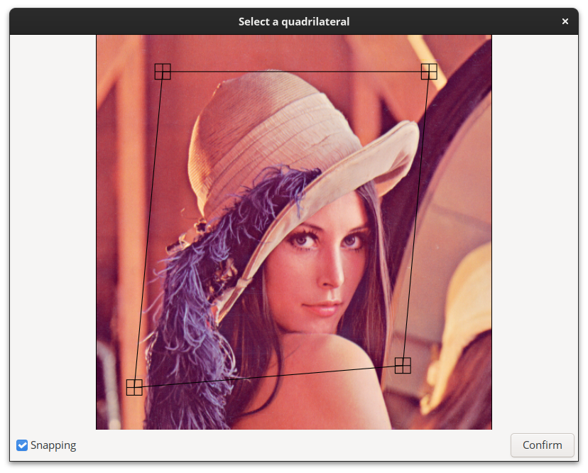

# 2D Image Selector

<p align="center">
  
</p>

Select2d is a simple GTK widget written in Python that allows users to load an image and interactively select a quadrilateral by placing four draggable points on the image. The coordinates of the selected quadrilateral are printed to standard output after confirmation.

**Note.** All this project was made by chatting with ChatGPT (GTK + ChatGPT = :heart:)

## Usage

1. Clone the repository:

```bash shell
$ git clone https://github.com/aziis98/gtk-select
```

2. Install the required dependencies:

```bash shell
$ pip install -r requirements.txt
```

3. Run the application with the desired options:

```bash shell
$ ./select2d [--title <title>] [--polyline] [--closed] <image>
```

4. The output contains the four points in the image.

**Arguments:**

- `<image>`: The path to the image file you want to load and select points on.

**Optional Arguments:**

- `--title` or `-t`: Set a custom window title for the application (default: "2D Image Selector").
- `--polyline` or `-s`: Show the outline of the quadrilateral that is formed by connecting the selected points.
- `--closed` or `-c`: Indicate if the drawn path should be closed, forming a closed polygon. This option is relevant only when displaying the quadrilateral with the previous option.

## Usage Example

To select a region of interest in the image "example.png" and display the outline of the selected region with a custom title "Region Selector" use the following command:

```bash shell
$ ./select2d example.png --title "Region Selector" --polyline
```

